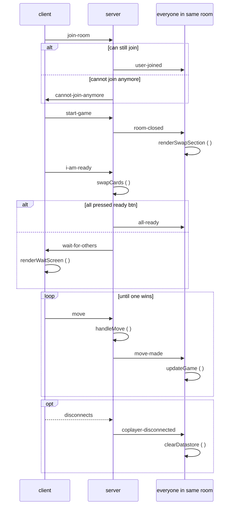

```mermaid
sequenceDiagram
    participant c as client
    participant s as server
    participant r as everyone in same room

    c ->> s: join-room
    alt can still join
        s->>r: user-joined
    else cannot join anymore
        s->>c: cannot-join-anymore
    end
    c ->> s: start-game
    s ->> r: room-closed
    r ->> r: renderSwapSection ( )
    c ->> s: i-am-ready
    s ->> s: swapCards ( )
    alt all pressed ready btn
        s ->> r: all-ready
    else
        s ->> c: wait-for-others
        c ->> c: renderWaitScreen ( )
    end
    loop until one wins
        c ->> s: move
        s ->> s: handleMove ( )
        s ->> r: move-made
        r ->> r: updateGame ( )
    end
    opt
        c -->> s: disconnects
        s ->> r: coplayer-disconnected
        r ->> r: clearDatastore ( )
    end
```