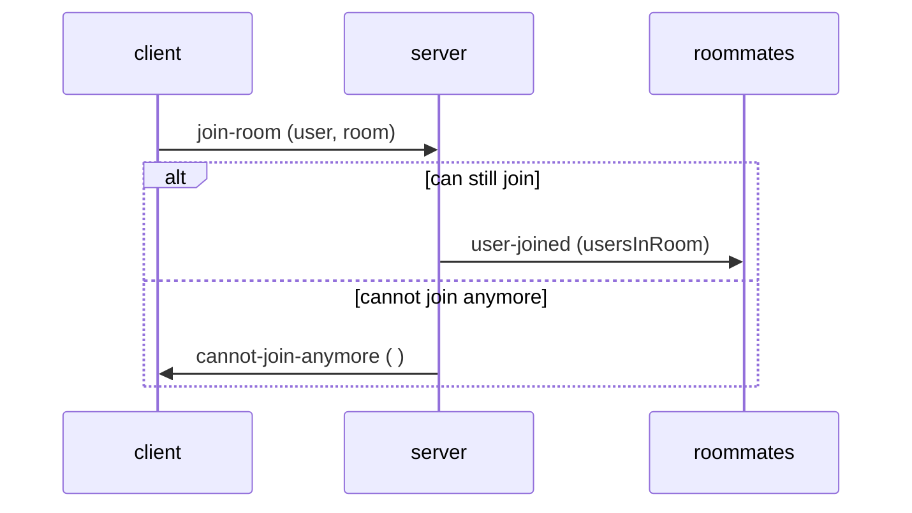

```mermaid
sequenceDiagram
    participant c as client
    participant s as server
    participant r as roommates

    c ->> s: join-room (user, room)
    alt can still join
        s->>r: user-joined (usersInRoom)
    else cannot join anymore
        s->>c: cannot-join-anymore ( )
    end
```